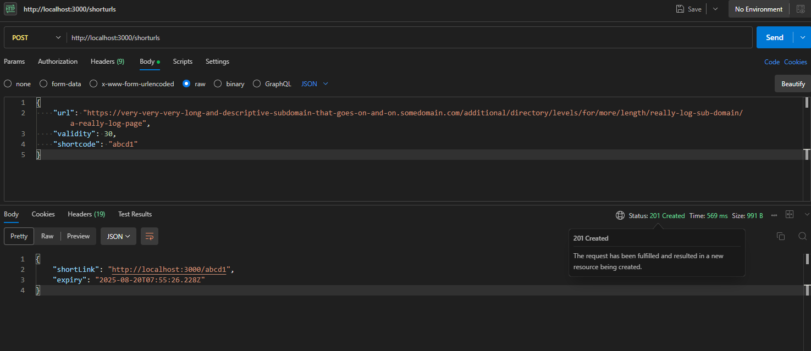
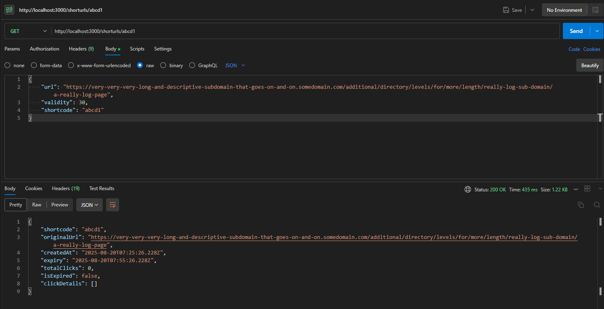

# Campus Hiring Evaluation - Roll Number: 2215045

A comprehensive HTTP URL Shortener Microservice with integrated Logging Middleware, built for Campus Hiring Backend Evaluation.

A simple and robust HTTP URL Shortener microservice with analytics capabilities, built with extensive logging integration.

## � API Output Examples

### Output-1: POST Request Response
**Request:** `POST http://localhost:3000/shorturls`
```json
{
    "url": "https://very-very-very-long-and-descriptive-subdomain-that-goes-on-and-on.somedomain.com/additional/directory/levels/for/more/length/really-log-sub-domain/a-really-log-page",
    "validity": 30,
    "shortcode": "abcd1"
}
```

**Response:**


*Expected Response (201 Created):*
```json
{
    "shortLink": "http://localhost:3000/abcd1",
    "expiry": "2025-08-20T08:00:00.000Z"
}
```

### Output-2: GET Request Response
**Request:** `GET http://localhost:3000/shorturls/abcd1`

**Response:**


*Expected Response (200 OK):*
```json
{
    "originalUrl": "https://very-very-very-long-and-descriptive-subdomain-that-goes-on-and-on.somedomain.com/additional/directory/levels/for/more/length/really-log-sub-domain/a-really-log-page",
    "shortcode": "abcd1",
    "createdAt": "2025-08-20T07:30:00.000Z",
    "expiresAt": "2025-08-20T08:00:00.000Z",
    "totalClicks": 0,
    "clickDetails": [],
    "isActive": true
}
```


## 🚀 Quick Start

### Installation
```bash
# Install all dependencies
npm install
```

### Run the Application
```bash
# Start the URL Shortener service
npm start

```

## 🏃‍♂️ Getting Started

1. **Clone the repository**
2. **Install dependencies**: `npm install`
3. **Start the server**: `npm start`
4. **Test the API**: Visit `http://localhost:3000/health`
5. **Run demos**: `npm run demo:backend`


**Student Submission for Campus Hiring Backend Evaluation**  
**Roll Number**: 2215045  
**Date**: August 20, 2025
